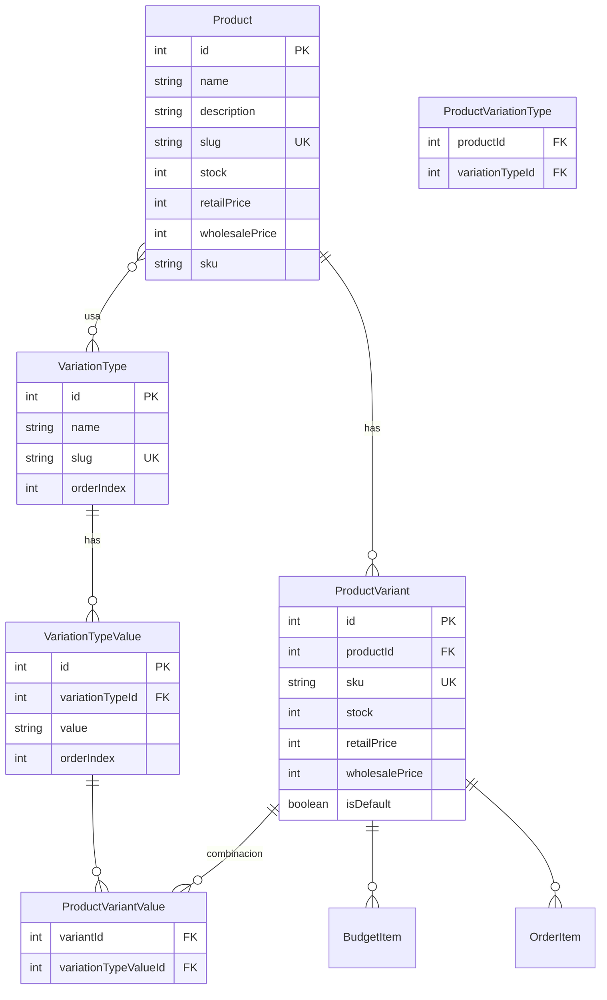
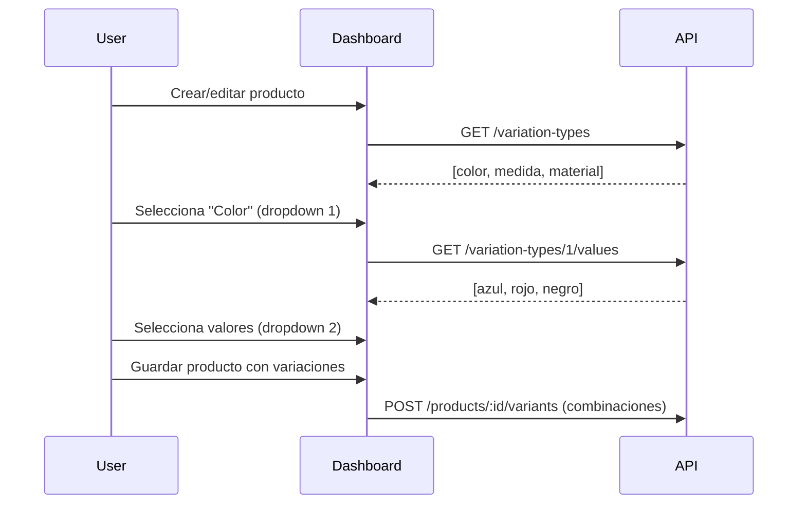
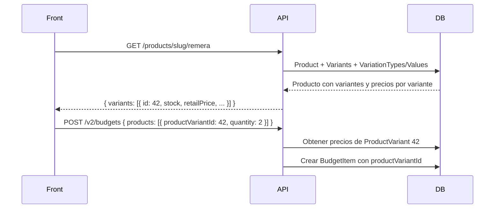

# Plan: Variantes de productos para e-commerce

## Cómo funciona el modo Plan

1. Yo investigo el codebase y propongo cambios sin ejecutarlos
2. Tú revisas el plan y lo apruebas (o pedís ajustes)
3. Una vez aprobado, pasás a modo Agent y yo implemento los cambios

---

## Estado actual (resumen)

| Entidad        | Stock         | Precios                                             | Imágenes                       |
| -------------- | ------------- | --------------------------------------------------- | ------------------------------ |
| **Product**    | `stock` (int) | `retailPrice`, `wholesalePrice`                     | `ProductImage` (N:M con Image) |
| **BudgetItem** | -             | `price`, `retailPrice`, `wholesalePrice` (snapshot) | vía `product.images`           |
| **OrderItem**  | -             | Idem                                                | vía `product.images`           |

- [schema.prisma](../prisma/schema.prisma): Product con stock y precios a nivel producto
- [BudgetItem](../prisma/schema.prisma) y [OrderItem](../prisma/schema.prisma): referencian `productId`
- [budgets.service.ts](../src/budgets/budgets.service.ts) y [orders.service.ts](../src/orders/orders.service.ts): buscan precios en `Product`

---

## Modelo de datos propuesto

### Tabla de tipos de variación vs tabla de atributos

Dos niveles separados y reutilizables:

| Tabla                  | Propósito                                                        | Ejemplo                                                              |
| ---------------------- | ---------------------------------------------------------------- | -------------------------------------------------------------------- |
| **VariationType**      | Tipos de variación (catálogo). Dropdown 1 en dashboard           | color, medida, material                                              |
| **VariationTypeValue** | Atributos/valores posibles de cada tipo. Dropdown 2 en dashboard | Color→azul, rojo, negro. Medida→S, M, L. Material→algodón, poliéster |

Un atributo pertenece a un solo tipo: no se puede asociar "rojo" a "medida". Evita combinaciones inválidas.

**Dashboard**: Dropdown 1 → tipo de variación. Dropdown 2 → valores de ese tipo.

### Nuevas tablas (solo adiciones en Fase 1, Product sin modificar)

| Tabla                    | Propósito                                                                                                   |
| ------------------------ | ----------------------------------------------------------------------------------------------------------- |
| **VariationType**        | Catálogo de tipos: color, medida, material. `name`, `slug`, `orderIndex`                                    |
| **VariationTypeValue**   | Valores por tipo: Color→azul,rojo; Medida→S,M,L. `variationTypeId`, `value`, `orderIndex`                   |
| **ProductVariationType** | Qué tipos usa cada producto. `productId`, `variationTypeId`                                                 |
| **ProductVariant**       | Variante (default o combinación). `productId`, `sku`, `stock`, `retailPrice`, `wholesalePrice`, `isDefault` |
| **ProductVariantValue**  | Valores de cada variante (vacío si es default). `variantId`, `variationTypeValueId`                         |

### Tablas existentes: sin cambios en Fase 1

- **Product**: se mantiene igual (stock, precios, sku). Datos duplicados con ProductVariant hasta la fase final.
- **ProductImage**: se mantiene en Product. Imágenes compartidas por todas las variantes.
- **BudgetItem** / **OrderItem**: se añade `productVariantId` (nullable). Se mantiene `productId`.

### Reglas acordadas

- Todo producto tiene al menos 1 variante: la **default** (productos sin variaciones definidas).
- Imágenes en Product (compartidas entre variantes).
- Front envía `productVariantId` en presupuestos/pedidos; suficiente para identificar.

---

## Estrategia de migración y compatibilidad

### Fase 1: Nuevas tablas sin tocar Product

1. Crear tablas: VariationType, VariationTypeValue, ProductVariationType, ProductVariant, ProductVariantValue
2. Añadir `productVariantId` (nullable) a BudgetItem y OrderItem
3. Para cada Product existente: crear 1 ProductVariant default con stock, precios, sku copiados
4. **Product permanece intacto**: stock, retailPrice, wholesalePrice, sku siguen en Product. Datos duplicados hasta actualizar dashboard y front.

### Endpoints v2 (compatibilidad durante desarrollo)

| V1 (actual, sin cambios)                   | V2 (nuevo)                                           |
| ------------------------------------------ | ---------------------------------------------------- |
| `POST /budgets` — acepta `productId`       | `POST /v2/budgets` — acepta `productVariantId`       |
| `PUT /budgets/:id` — ítems con `productId` | `PUT /v2/budgets/:id` — ítems con `productVariantId` |
| `POST /orders` — acepta `productId`        | `POST /v2/orders` — acepta `productVariantId`        |
| `PUT /orders/:id` — ítems con `productId`  | `PUT /v2/orders/:id` — ítems con `productVariantId`  |

- Front actual sigue usando v1 sin cambios.
- Front nuevo usa v2 con productVariantId.
- Cuando migre todo el front, eliminar endpoints v1 y renombrar v2 a rutas principales.

### Fase final: limpieza

- Actualizar dashboard para configurar variantes.
- Actualizar front para enviar solo productVariantId (usar v2).
- Eliminar columnas obsoletas de Product: stock, retailPrice, wholesalePrice, sku.
- Eliminar endpoints v1. Renombrar v2 a rutas principales si se desea.

---

## Módulos a modificar

### 1. VariationTypes (nuevo módulo – catálogo)

- **CRUD** de VariationType y VariationTypeValue
- Endpoints: `GET/POST/PUT/DELETE /variation-types`, `GET/POST/PUT/DELETE /variation-types/:id/values`
- Usado por el dashboard: dropdown 1 (tipo) → dropdown 2 (valores del tipo)

### 2. Products

- **ProductImage**: se mantiene en Product (sin cambios)
- **Variantes**: endpoints `GET /products/:id/variants`, `POST /products/:id/variants`, `PUT /products/:id/variants/:variantId`, `DELETE /products/:id/variants/:variantId`
- **Asociación tipos**: al crear/editar producto, asignar qué VariationType usa (ProductVariationType)
- **Variante default**: productos sin variaciones definidas tienen 1 variante default (creada en migración o al guardar)
- **GET /products** y **GET /products/:id**: incluir variantes, stock total (suma), precios mín/máx
- **Update prices**: `PUT /products/update-prices` pasa a operar sobre ProductVariant

### 3. Budgets

- **V1** (sin cambios): `POST /budgets`, `PUT /budgets/:id` siguen usando `productId`
- **V2** (nuevo): `POST /v2/budgets`, `PUT /v2/budgets/:id` aceptan `productVariantId` en los ítems
- **BudgetsService**: método/flujo separado para v2 que resuelve precios desde ProductVariant
- **BudgetItem**: incluir relación `productVariant` con `product` anidado en respuestas

### 4. Orders

- **V1** (sin cambios): `POST /orders`, `PUT /orders/:id` siguen usando `productId`
- **V2** (nuevo): `POST /v2/orders`, `PUT /v2/orders/:id` aceptan `productVariantId` en los ítems
- **OrdersService**: flujo v2 que persiste `productVariantId` en OrderItem

---

## Flujo dashboard: configurar variaciones

## Flujo compra: presupuesto con variante (v2)

---

## Orden de implementación

1. **Fase 1 - Schema**: Crear VariationType, VariationTypeValue, ProductVariationType, ProductVariant, ProductVariantValue. Añadir productVariantId a BudgetItem/OrderItem. Migrar datos (variante default por producto). Product sin modificar.
2. **Fase 2 - VariationTypes**: Módulo CRUD para tipos y valores (catálogo).
3. **Fase 3 - Products**: Endpoints de variantes, asociación tipos, variante default. Listados con variantes.
4. **Fase 4 - Budgets y Orders v2**: Crear `POST /v2/budgets`, `PUT /v2/budgets/:id`, `POST /v2/orders`, `PUT /v2/orders/:id` con productVariantId. Mantener v1 sin cambios.
5. **Fase 5 - Update prices**: Operar sobre ProductVariant.
6. **Fase 6 - Limpieza**: Eliminar stock, retailPrice, wholesalePrice, sku de Product. Eliminar endpoints v1. Renombrar v2 a rutas principales si se desea.
